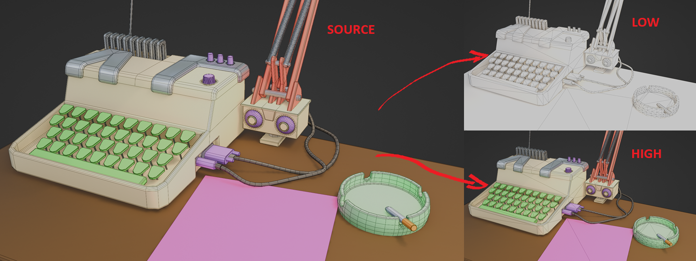
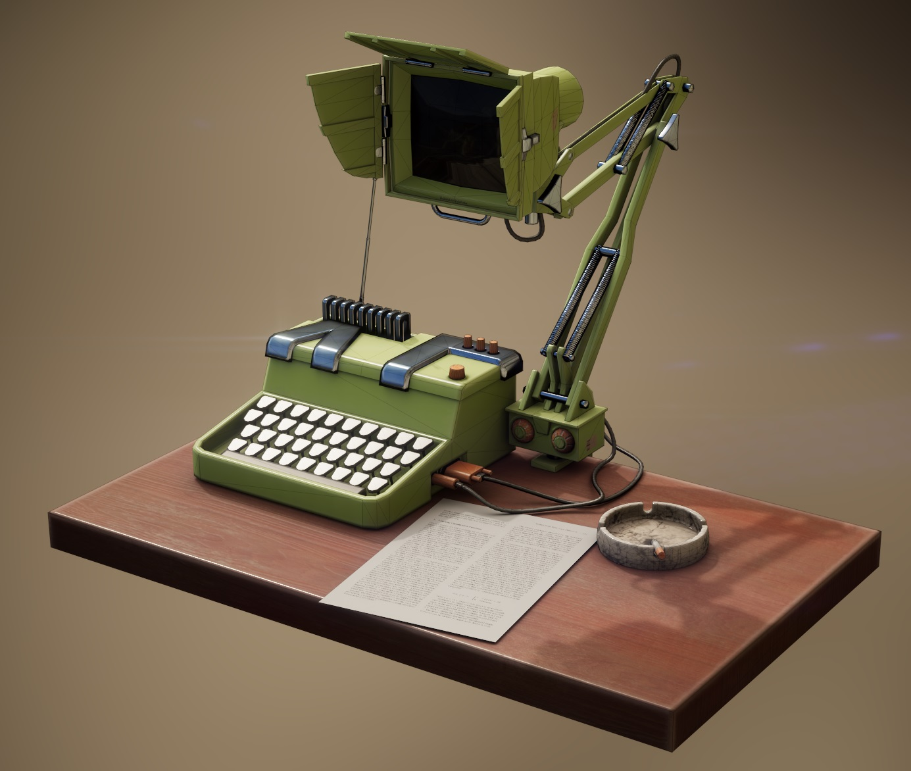
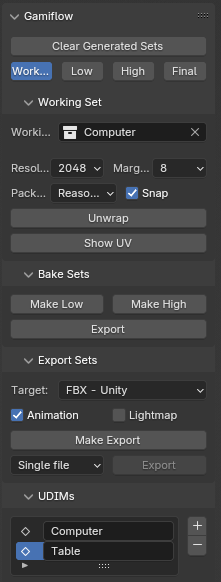
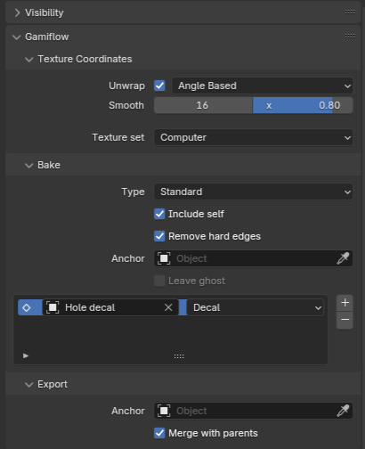

I have seen many game artists waste so much time trying to keep their low/high poly meshes in sync with their main ones only to realise that they missed half of them when baking. So I decided to automate this workflow as much as possible with some non-destructive system that lets you add metadata to your objects and geometry and then automate the generation of low and high poly meshes for Substance Painter. You should never have to manually duplicate your objects and add some _low and _high to their names.

 

 Your bakes are pretty much guaranteed to be perfect.
 
 

# Features
 - One-click low/high poly generation for baking
   - Tag edges you want dissolved
   - Tag modifiers that should only be used for the high-poly
   - Let GamiFlow generate the baking meshes
   - Substance Painter naming convention respected for guaranteed perfect bakes
 - One-click export mesh generation
   - Object hierarchies are collapsed and meshes merged when possible
   - Automatic lightmap UVs
   - Can also export as individual objects
 - Unwrap once, update in one click
   - Assign UDIM to object
   - Choose unwrapping method 
   - Tag faces to be gridified 
   - Choose UV island scale
   - Choose UV island orientation  

# Key Concepts

## Sets
Gamiflow works with multiple *sets* (which really just means "collection") which all have a specific use:
- Working set: what you will be interacting with. this is where you will model and unwrap your objects.
- Bake sets: geometry generated automatically from the Working Set.
  - Low: what is used as base mesh in Substance Painter
  - High: what is used to bake normals, AO, and id masks.
- Export set: the final optimised geometry, also auto-generated.
You technically only ever need to look at the Bake and Export sets to check that everything is correct.

Before you can begin working with Gamiflow, you need to set your **Working Set** in the side panel.
Later on, once you've generated the other sets, you can easily navigate between sets using the buttons at the top: click to jump to the set, and ctrl-click to toggle a set.

## Menus
### Main Panel

The main panel will be on the side of the viewport, in the Gamiflow tab. When in Object Mode, this is where you can generate the different sets as well as navigate between them. You can also unwrap and pack the UVs as well as add and rename UDIMs.
In edit mode, it lets you set the size and orientation of UV islands as well as mark which faces must have their UV turned into a nice grid.

### Object properties

The Gamiflow panel of the Object properties tab lets you set how you want the object to be unwrapped and how it should be baked. This is where you can manually add a specific high-poly mesh or a decal to your object.

### Pie menu
Shift-V to open the pie menu. In object mode, it lets you quickly set the smoothing mode to what should be your default when dealing with game assets, as well as add a bake-only bevel (i.e. a bevel that only shows up in the bake and not in your low-poly).
In edge mode, it lets you tag edges as High Detail (will only show up in the high-poly mesh), Painter Detail (shows up in the high-poly and low-poly baking meshes, but not in the final export mesh), and Regular Detail (a normal edge that won't be dissolved). It also has shortcuts for marking seams, either soft (default Blender behaviour) or hard (also hardens the selected edges).
In face mode, it lets set which faces must have their UV turned into a nice grid.

## Non-destructive workflow
The idea is that you should be able to model once, tag some edges or modifiers, set your uv seams, and then automatically generate your low and high poly meshes. You should never have to manually duplicate meshes and dissolve some edges to make your low-poly.

### High-poly modifiers
Some modifiers, (such as subdivision or bevel modifiers) are usually not desirable for a game asset, but crucial for the high-poly mesh used during the bake process. As such there is a (albeit hacky) way to tag modifiers as being intended for high-poly only. Untick the modifier's *Render* button (the camera icon), and it will be ignored when generating low-poly meshes.
There is a shortcut to create a quick high-poly bevel in the Shift-V pie menu (in object mode).

### Dissolving edges
In edit mode, select edges you only want to see in the high-poly, and press Shift-V to bring up the pie menu. Select *Mark High Detail*, and the edges should now be marked in yellow. If you want to revert the edges to their standard state, select *Mark Regular Detail*.

### Custom High-Poly
Sometimes a simple edge dissolve won't do it and you do need two very different meshes (e.g. a super dense sculpt and its retopo). In this case, you can change the object's bake settings. First, disable *Include self* (this means this object won't get pushed to the bake sets), then click the + icon and pick your sculpt. Make sure the high-poly object type is set to **Projected**.

### Auto-UVs
**!!!OPINION WARNING!!!**
>You should (almost) never have to manually pack your UV islands, this is a waste of time and will only make you scared of modifying your assets later on. My preferred workflow is to manually place UV seams as usual, but then let the unwrapper and packer do everything for me. There are ways to tag edges that need to have a specific alignment in UV space, or to tag faces that need to be neatly "gridified", or to tweak the size of some UV islands. And if you're adamant that your manually unwrapping is superior than the automatic one, you can always tell Gamiflow to keep it as is. This should be enough to deal with the vast majority of needs.

The workflow assumed with this plugin is as follows: you make your object, you add seams to it, and you check that it unwrapped nicely. Make note of which unwrapping method worked best (angle based, or conformal). Go to the object properties and set which unwrapping method worked best for you. You can also tweak the amount of UV smoothing you want. If you were not satisfied with the Blender unwrapper and had to do a lot of manual tweaking, you can save the current UV by unticking *Unwrap*. If you are working with multiple UDIMs in your scene, assign the relevant one to the object.
You can now return to the side panel and click on *Unwrap*. This will unwrap and pack your entire scene. 
>When using the highest packing quality with the standard Blender packer, this operation can take a while and I recommend installing the free [UV-Packer](https://www.uv-packer.com/download/) plugin which is incredibly good and fast, and can be set as the packing method used by Gamiflow in the settings.

All objects sharing a UDIM will be packed together in the same [0,1[ UV square. Each UDIM will essentially become a distinct material in the game engine with its own set of textures. The UDIM name is what Substance Painter will use as name for its texture set.

### Anchors
Sometimes, things get in the way. Imagine you modelled a gun with its ammo magazine inside, making it difficult to texture it. You can set a *Bake Anchor* on the magazine. When generating the Bake Sets, the magazine will be teleported to its anchor.

